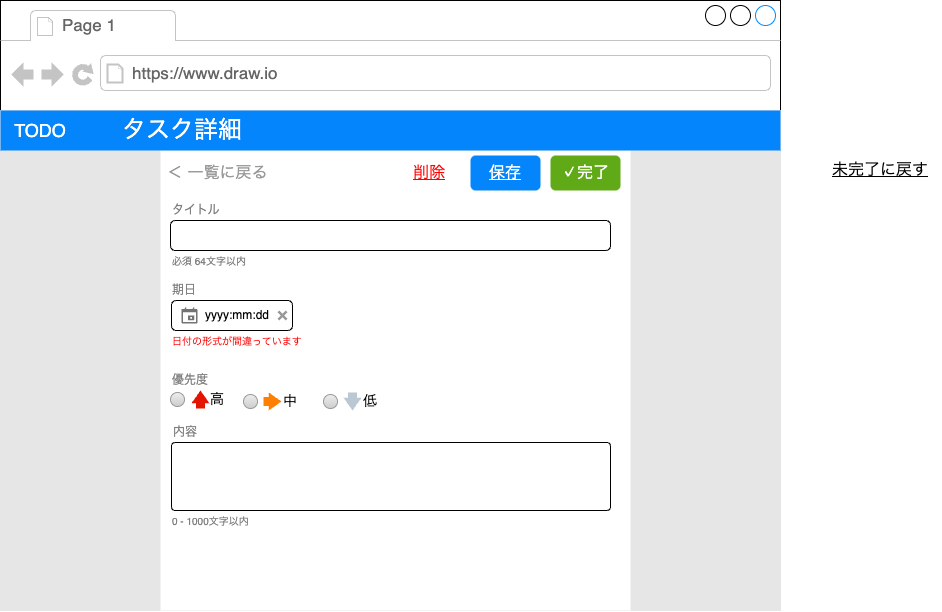

# TODO アプリ 機能仕様

## アプリの概要

TODO アプリは、タスクの追加、編集、削除、完了の管理を行うことができる Web アプリです。

## 機能一覧

- ユーザーの認証
- タスクの追加
- タスクの編集
- タスクの削除
- タスクの完了
- タスクの一覧表示
  - タスクのフィルタリング
    - 優先度
    - タイトル
- タスクの詳細表示

## タスクの項目

- タイトル
  - 文字列
  - 64 文字以内
  - 1 文字以上
- 内容
  - 文字列
  - 1000 文字以内
  - 0 文字を許容する
- 期日
  - 日時
  - 未設定を許容する
- ステータス
  - 未完了
  - 完了
- 優先度
  - 低
  - 中(デフォルト)
  - 高

## 画面仕様

### ログイン画面

- メールアドレス
  - 必須
  - メールアドレスの形式
- パスワード
  - 必須
- エラーメッセージ
  - メールアドレスまたはパスワードが間違っている場合に表示
- ログインボタン
  - メールアドレスとパスワードが入力されている場合に有効
  - クリックするとログイン処理リクエストを送信する
  - 認証に成功した場合、タスク一覧画面に遷移する

### タスク一覧画面

- タスクフィルタ
  - タイトルの一部
  - 優先度"高"のみ
  - ステータス"完了"も含む
- タスクの一覧
  - 期日の昇順で表示
  - フィルタの条件に一致するタスクのみ表示
- タスクの行
  - タスクのタイトル
  - タスクの期日
  - タスクの優先度
    - 低： 灰色の下矢印アイコンで表示
    - 中： オレンジ色の中矢印アイコンで表示
    - 高： 赤色の上矢印アイコンで表示
  - タスクのステータス
    - 未完了： 空欄のチェックボックス
    - 完了： チェック済みのチェックボックス
    - クリックすると、ステータスをトグルで切り替える
  - タスクの内容
    ― タスクの内容を一行で表示する。はみ出す場合は、省略記号を表示する。
  - タスク行をクリックしたら、タスクの詳細画面に遷移する。

### タスク詳細画面

- 一覧に戻る
  - クリックすると、タスク一覧画面に遷移する
  - 内容に変更があった場合、変更内容が破棄される旨の確認ダイアログを表示する。
- 保存ボタン
  - クリックすると、入力内容を検証し、タスクの登録または更新処理リクエストを送信する
    ― 入力内容の検証に失敗した場合、各項目の下にエラーメッセージを表示する
  - タスクの保存処理が完了したら、タスク一覧画面に遷移する
- 削除ボタン
  - クリックすると、タスクの削除処理リクエストを送信する。
  - 事前に確認ダイアログを表示する。
- タスクのタイトル
  - テキストボックス
  - 下のメッセージは常に表示する。エラーが有る場合、赤く表示する。
- タスク期日
  - 日付ピッカーで選択できる。
  - 未設定の場合は、空欄を表示する。
  - X ボタンでクリアできる。
  - エラーが有る場合、赤く表示する。
  - 下のメッセージはエラーが有るときのみ表示する
- タスクの優先度
  - ラジオボタンで選択できる。
- 内容
  - 複数行のテキストボックス（TextArea）
  - 下のメッセージは常に表示する。エラーが有る場合、赤く表示する。
